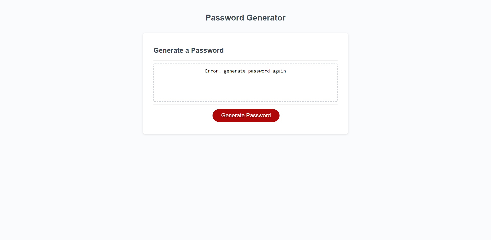

# Random Password Generator 

    This file contains the basic html, css, and javascript for a webpage the generates 
    random passwords to the user preferance. 

    The preferance includes over 20 special character, both lower and upper case letters, 
    and numerical values ranging from 8 to 128 characters.
    

# Authors
    Sophia Kiani 
    Version 1.1

# Screen Shot
`
    

    
# Link
`
    [Check out Sophk Security: Random Password Generator...](https://soph-k.github.io/sophk_security_random_password_generator/)
    [Or check out the GitHub repository for Sophk Security: Random Password Generator](https://github.com/soph-k/sophk_security_random_password_generator/) 

